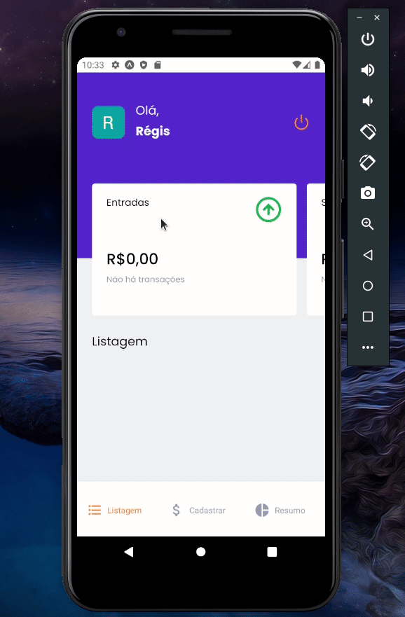

# igniteGoFinancesRN

<h1>
  
</h1>



<h3 align="center">
  App on ReactNative and social login with Google and Apple
</h3> 

## :open_file_folder: About

The App its about a finance storage, the goal of the app is that you can control your spends.

</br>

## :rocket: Technologies

- [Expo](https://docs.expo.dev/)
- [StyledComponents](https://styled-components.com)

</br>

## :key: How to download the project

```bash
# clone the repo:
$ git clone https://github.com/Regis-Oliveira/igniteGoFinancesRN.git

# open the project:
$ cd igniteGoFinancesRN

# install the dependencies:
$ yarn install

# execute with:
$ yarn android / yarn ios
```

### :tada: See the app executing on:

 - Emulator

</br>

## :fire: Credits
  **Ignite** course by: [Rocketseat](https://app.rocketseat.com.br/)
  </br>
  Layout by [ThiagoLuchtenberg](https://www.instagram.com/tiagoluchtenberg/) 
  
  </br>

 ## :pencil2: Contact Me

- [Linkedin](www.linkedin.com/in/regis-de-oliveira-cardoso)
- :inbox_tray: Email: (oliveiracregis01@gmail.com)

</br>

---
Desenvolvido com :heart: por **Régis de Oliveira Cardoso**.
